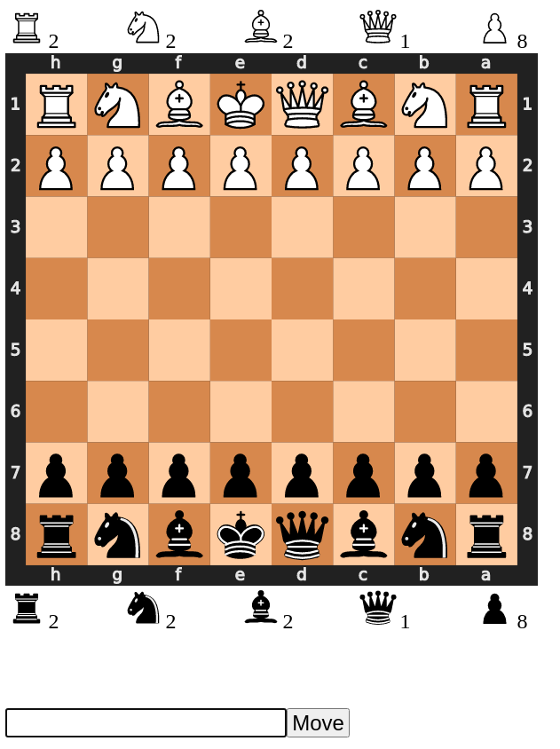
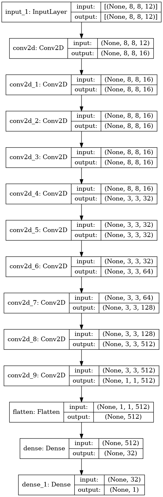

# Chess Engine

Objective: Create neural network which can evaluate a position from -1 to 1. Since this neural network will only be 1-ply, uses minimax to look forward in the position search tree to see which move forces the best evaluation x moves ahead of the current position; alpha beta pruning is used to prune the search tree. 

## Instructions

Create Virtual Environment:
	Linux or Mac: `python3 -m venv venv`	
		

Install dependencies:
	Linux or Mac: `pip3 install -r requirements.txt`

Run play.py
	Linux or Mac: `python3 play.py`

If running on server, enter the following command to serve flask webapp to localhost:5000: `ssh -L 5000:localhost:5000 -i server-address` 

Open localhost:5000 (Script should do this automatically if not running on server)

## UI

## Model Architecture:

## Documentation

Finish this

## Improvements

Model Architecture can be improved, just don't have access to compute needed to test out model with variety of different hyperparameters.

Try out progressive deepening + reordering of search tree to increase alpha beta pruning

Make model architecture lightweight
