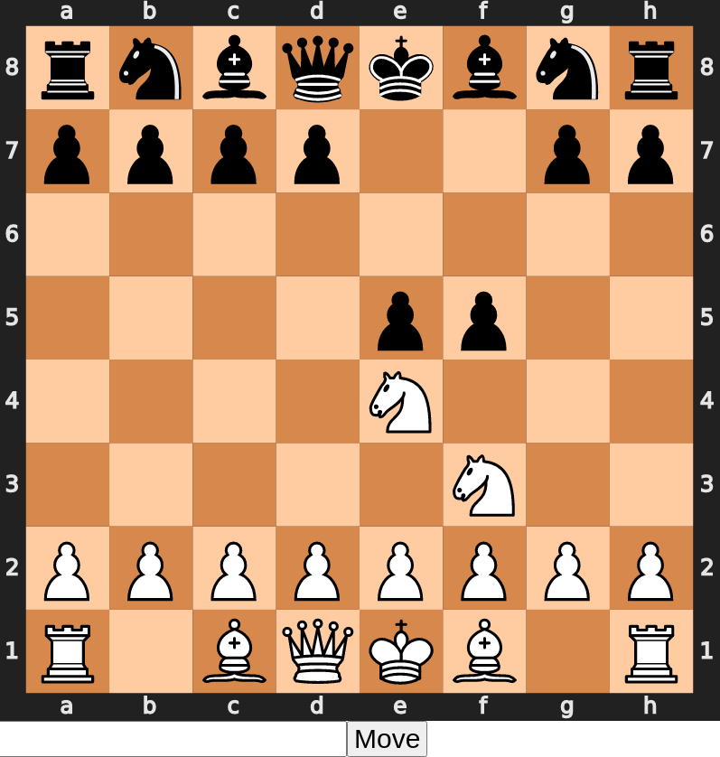

# Chess Engine - In Progress
Objective: Create neural network which can evaluate a position from -1 to 1. Whichever legal move that maximizes the evaluation score is the move the chess engine should play. Currently working on implementing minimax and alpha beta pruning afterwards for more than 1 ply

## UI

## Current Model Architecture:

TODO:

Minimax and Alpha Beta pruning Search Tree

Improve NN architecture

Incremental dumping to npy

Generator read from numpy dataset

http://www.diva-portal.se/smash/get/diva2:1366229/FULLTEXT01.pdf
