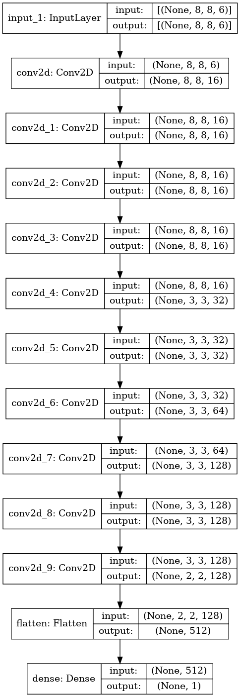

# Chess Engine

Objective: Create neural network which can evaluate a position from -1 to 1. Since this neural network will only be 1-ply, uses minimax to look forward in the position search tree to see which move forces the best evaluation x moves ahead of the current position; alpha beta pruning is used to prune the search tree. 

## Instructions

Install dependencies:
	pip3 install -r requirements.txt

Run play.py
	Linux: python3 play.py

If running on server, enter the following command to serve flask webapp to localhost:5000: 'ssh -L 5000:localhost:5000 -i server-address' 

Open localhost:5000

## UI

## Model Architecture:

## Documentation

Finish this

## Improvements

Model architecture has lots of potential to improve, it just takes a lot of compute and time to train which prevents better tuning of the hyper parameters. My custom model works most of the time but in certain cases will devalue certain obviously good capture of pieces.The lookahead capability also seems to affect the "playing principles" of the engine such as how pieces are conventionally developed. The lookahead capability with minimax is required since the model is not yet good enough to see further than 1 or 2 ply on it's own.
