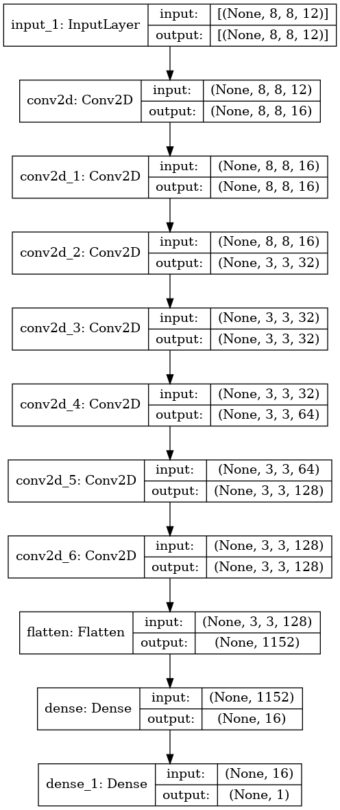

# Chess Engine - In Progress
Objective: Create neural network which can evaluate a position from -1 to 1. Whichever legal move that maximizes the evaluation score is the move the chess engine should play.  

Current Model Architecture:

